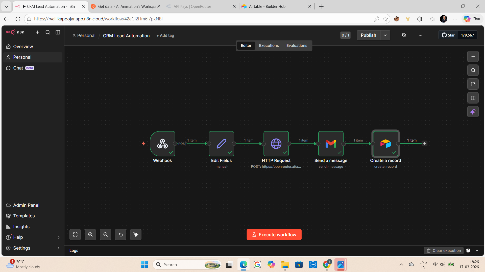

# n8n CRM Lead Automation

Automated lead response system built using n8n, AI, Gmail, and Airtable.

---

## 🔥 What This Automation Does
- Captures leads via webhook instantly
- Cleans and structures lead data
- Sends data to AI (OpenRouter)
- Generates intelligent replies automatically
- Sends email responses via Gmail
- Stores leads in Airtable CRM

---

## 🧠 Tech Stack
- n8n (workflow automation)
- OpenRouter API (AI responses)
- Gmail API
- Airtable

---

## ⚙️ Workflow Breakdown
1. Webhook receives incoming lead data  
2. Edit Fields formats the input  
3. HTTP Request sends data to AI  
4. AI generates response message  
5. Gmail sends reply to lead  
6. Airtable stores lead data  

---

## 🚀 Setup Instructions
1. Download the JSON file  
2. Import into n8n  
3. Add your credentials:
   - OpenRouter API key  
   - Gmail account  
   - Airtable API  
4. Activate the workflow  

---

## 🎯 Use Cases
- Real estate lead automation  
- Lead generation agencies  
- CRM automation systems  

---

## 📸 Workflow Preview

